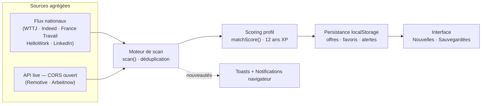

# RADAR·QA — Veille d'offres d'emploi QA en continu


Poste de veille qui **rapatrie en continu** les nouvelles offres pour un profil
**QA Engineer / Testeur logiciel — 12 ans d'expérience — Paris & Île-de-France**.
Scan automatique, détection des nouveautés en temps réel, scoring de
compatibilité avec le CV (GitHub), alertes mots-clés, favoris et exports.



---

## ✦ Fonctionnalités

### Rapatriement & mise à jour automatique
- **7 sources agrégées** avec indicateur d'état par source (en ligne / en scan / hors ligne)
- **Scan automatique paramétrable** : 30 s, 1 min, 2 min, 5 min, 10 min
- Compte à rebours circulaire jusqu'au prochain scan, pause/reprise, scan manuel
- **Détection des nouveautés** : badge cloche, badges `NOUVEAU` pulsants, toasts récapitulatifs
- **Notifications navigateur** opt-in à chaque nouvelle offre
- APIs **Remotive** et **Arbeitnow** interrogées en direct (CORS ouvert, timeout 6,5 s, repli propre)

### Triage complet
- Recherche instantanée (raccourci `/`) sur titre, entreprise, technos
- Filtres : **contrat** (CDI · CDD · Freelance · Alternance), **localisation** (Paris · petite couronne · full remote), **mode de travail**, **salaire minimum** (TJM freelance annualisé), **niveau d'expérience**
- 30 technos cochables : Selenium, Cypress, Playwright, Appium, ISTQB, Cucumber/BDD, JMeter, CI/CD…
- Activation/désactivation individuelle des sources
- **Score Match** pondéré sur le profil senior (badge dès 60 %)
- Onglets **Toutes / Nouvelles / Sauvegardées**, tri par date · salaire · match
- Vue compacte / confortable, favoris, masquage, marquage lu

### Productivité
- **Alertes mots-clés** (badge `ALERTE` sur les offres correspondantes)
- Fiche détaillée par offre (contexte, stack, lien direct pour postuler)
- **Export CSV et JSON** de la vue courante
- Persistance complète entre les sessions (localStorage)

---

## 🚀 Installation

```bash
git clone https://github.com/VOTRE-UTILISATEUR/radar-qa.git
cd radar-qa
npm install
npm run dev        # → http://localhost:5173
```

### Build de production

```bash
npm run build      # → dist/
npm run preview    # tester le build localement
```

---

## 📂 Architecture

```
radar-qa/
├── index.html                  # Point d'entrée (polices Space Grotesk / IBM Plex / JetBrains Mono)
├── src/
│   ├── main.tsx                # Montage React
│   ├── App.tsx                 # Orchestrateur : moteur de scan, état global, auto-update
│   ├── types.ts                # Modèle : Job, Filters, Prefs, SourceId…
│   ├── index.css               # Thème Tailwind v4, scène ambiante, animations
│   ├── data/
│   │   └── jobs.ts             # Référentiel sources, profil, pool d'offres, scoring
│   ├── lib/
│   │   ├── api.ts              # Connecteurs API live (Remotive, Arbeitnow)
│   │   └── utils.ts            # Formatage, persistance, export CSV
│   └── components/
│       ├── Header.tsx          # Statut scan, compte à rebours, cloche, raccourcis
│       ├── StatsBar.tsx        # Métriques + radar animé
│       ├── Filters.tsx         # Panneau de filtres complet + alertes + exports
│       ├── JobCard.tsx         # Carte d'offre (badges, match, actions)
│       ├── JobDrawer.tsx       # Fiche détaillée
│       ├── Toasts.tsx          # Notifications in-app
│       └── icons.tsx           # Bibliothèque d'icônes SVG inline
├── LICENSE                     # MIT
└── README.md
```

---

## ⚙️ Vers un agrégateur 100 % temps réel

Les job boards français (WTTJ, Indeed, France Travail…) ne proposent pas
d'API publique ouverte au navigateur : leurs données sont servies par un
**flux simulé réaliste** côté client, clairement identifié, complété par les
deux API réellement interrogées en direct.

Pour passer en production complète, brancher un petit serveur intermédiaire :

| Source          | Accès officiel                                     |
| --------------- | -------------------------------------------------- |
| France Travail  | `entreprise.pole-emploi.fr` — API Offres (OAuth 2) |
| Adzuna          | `developer.adzuna.com` — clé gratuite              |
| JSearch / RapidAPI | agrégateur multi-sites, clé gratuite           |
| WTTJ            | Partenariat / scraping encadré (CGU)               |

Le format `Job` (`src/types.ts`) est pensé comme contrat d'échange : il suffit
d'adapter le parseur dans `src/lib/api.ts`.

---

## 🗺️ Roadmap

- [ ] Serveur agrégateur (Node) + endpoints France Travail / Adzuna
- [ ] Flux RSS par recherche sauvegardée
- [ ] Digest email hebdomadaire des offres `Match ≥ 80 %`
- [ ] Suivi des candidatures (statuts : postulé · entretien · refus)
- [ ] PWA installable avec scan en tâche de fond

---

## 📄 Licence

Distribué sous licence **MIT** — voir le fichier [LICENSE](./LICENSE).
