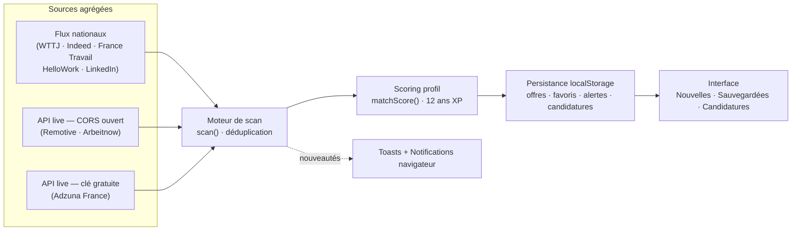

# RADAR·QA — Veille d'offres d'emploi QA en continu

Poste de veille qui **rapatrie en continu** les nouvelles offres pour un profil
**QA Engineer / Testeur logiciel — 12 ans d'expérience — Paris & Île-de-France**.
Scan automatique, détection des nouveautés en temps réel, scoring de
compatibilité avec le CV, alertes mots-clés, suivi de candidatures, favoris et exports.



## ✦ Fonctionnalités

### Rapatriement & mise à jour automatique

- **8 sources agrégées** avec indicateur d'état par source (en ligne / en scan / hors ligne)
- **Scan automatique paramétrable** : 30 s, 1 min, 2 min, 5 min, 10 min
- Compte à rebours circulaire jusqu'au prochain scan, pause/reprise, scan manuel
- **Détection des nouveautés** : badge cloche, badges `NOUVEAU` pulsants, toasts récapitulatifs
- **Notifications navigateur** opt-in à chaque nouvelle offre
- API **Remotive** et **Arbeitnow** interrogées en direct (CORS ouvert, timeout 6,5 s, repli propre)
- API **Adzuna France** (vraies offres FR) : collez votre `app_id` / `app_key` gratuits
  dans le panneau filtres — [developer.adzuna.com](https://developer.adzuna.com).
  Les clés ne quittent jamais votre navigateur.

### Suivi des candidatures

- Onglet **Candidatures** : pipeline kanban **Postulé · Entretien · Refus**
- « Marquer comme postulé » depuis la fiche offre, changement de statut en un clic
- **Note libre** par candidature (contact, relance, lien…), date de dernière maj
- Badge de statut sur les cartes du flux, tuile dédiée dans les métriques

### Triage complet

- Recherche instantanée (raccourci `/`) sur titre, entreprise, technos
- Filtres : **contrat** (CDI · CDD · Freelance · Alternance), **localisation** (Paris · petite couronne · full remote), **mode de travail**, **salaire minimum** (TJM freelance annualisé), **niveau d'expérience**
- 30 technos cochables : Selenium, Cypress, Playwright, Appium, ISTQB, Cucumber/BDD, JMeter, CI/CD…
- Activation/désactivation individuelle des sources
- **Score Match** pondéré sur le profil senior (badge dès 60 %)
- Onglets **Toutes / Nouvelles / Sauvegardées / Candidatures** (raccourcis `1` à `4`), tri par date · salaire · match
- Vue compacte / confortable, favoris, masquage, marquage lu

### Productivité

- **Alertes mots-clés** (badge `ALERTE` sur les offres correspondantes)
- Fiche détaillée par offre (contexte, stack, lien direct pour postuler)
- **Export CSV, JSON et flux RSS 2.0** de la vue courante
- **PWA installable** : manifeste + service worker (enveloppe hors-ligne), bouton d'installation dans l'en-tête
- **Thème sombre / clair** mémorisé
- Persistance complète entre les sessions (localStorage)

## 🚀 Installation

```bash
git clone https://github.com/AtmanTest/qaradar.git
cd qaradar
npm install
npm run dev        # → http://localhost:3000
```

### Build de production

```bash
npm run build      # → dist/
npm run preview    # tester le build localement
```

Le build utilise des chemins relatifs (`base: "./"`) : il fonctionne tel quel sur
**GitHub Pages** (dossier `docs/` servi en sous-chemin), en local ou derrière
n'importe quel hébergement statique.

### Qualité

```bash
npm run typecheck  # vérification TypeScript stricte
npm run lint       # ESLint (flat config, react-hooks)
npm test           # 25 tests unitaires Vitest (utils, scoring, parsing API)
```

Une **GitHub Action** (`.github/workflows/ci.yml`) exécute typecheck + lint +
tests + build sur chaque push et pull request.

## 📂 Architecture

```
qaradar/
├── index.html                  # Point d'entrée (polices, manifeste PWA, thème anti-flash)
├── public/
│   ├── manifest.webmanifest    # PWA : nom, icônes, standalone
│   ├── sw.js                   # Service worker (app shell hors-ligne)
│   └── icons/                  # Icônes PWA 192 / 512 / maskable
├── src/
│   ├── main.tsx                # Montage React + enregistrement du service worker
│   ├── App.tsx                 # Orchestrateur : moteur de scan, état global, auto-update
│   ├── types.ts                # Modèle : Job, Filters, Prefs, Application, ApiKeys…
│   ├── index.css               # Thème Tailwind v4 (sombre + clair), scène ambiante
│   ├── data/
│   │   └── jobs.ts             # Référentiel sources, profil, pool d'offres, scoring
│   ├── lib/
│   │   ├── api.ts              # Connecteurs API live (Remotive, Arbeitnow, Adzuna)
│   │   └── utils.ts            # Formatage, persistance, exports CSV / RSS
│   └── components/
│       ├── Header.tsx          # Statut scan, compte à rebours, thème, installation PWA
│       ├── StatsBar.tsx        # Métriques + radar animé + tuile candidatures
│       ├── Filters.tsx         # Panneau de filtres + clés Adzuna + alertes + exports
│       ├── JobCard.tsx         # Carte d'offre (badges, match, statut candidature)
│       ├── JobDrawer.tsx       # Fiche détaillée + suivi de candidature
│       ├── Applications.tsx    # Pipeline kanban Postulé · Entretien · Refus
│       ├── Toasts.tsx          # Notifications in-app
│       └── icons.tsx           # Bibliothèque d'icônes SVG inline
├── tests/                      # Tests unitaires Vitest
├── .github/workflows/ci.yml    # CI : typecheck, lint, tests, build
├── docs/                       # Build statique pour GitHub Pages
├── LICENSE                     # MIT
└── README.md
```

## ⚙️ Vers un agrégateur 100 % temps réel

Les job boards français (WTTJ, Indeed, France Travail…) ne proposent pas
d'API publique ouverte au navigateur : leurs données sont servies par un
**flux simulé réaliste** côté client, clairement identifié, complété par les
API réellement interrogées en direct (Remotive, Arbeitnow, et Adzuna avec votre clé).

Pour passer en production complète, brancher un petit serveur intermédiaire :

| Source             | Accès officiel                                       |
| ------------------ | ---------------------------------------------------- |
| Adzuna             | `developer.adzuna.com` — clé gratuite ✅ **déjà branché** |
| France Travail     | `entreprise.pole-emploi.fr` — API Offres (OAuth 2)   |
| JSearch / RapidAPI | agrégateur multi-sites, clé gratuite                 |
| WTTJ               | Partenariat / scraping encadré (CGU)                 |

Le format `Job` (`src/types.ts`) est pensé comme contrat d'échange : il suffit
d'adapter le parseur dans `src/lib/api.ts`.

## 🗺️ Roadmap

- [x] Suivi des candidatures (statuts : postulé · entretien · refus) — **v2.0**
- [x] Export RSS de la vue courante — **v2.0**
- [x] PWA installable (manifeste + service worker) — **v2.0**
- [x] Connecteur Adzuna France (vraies offres, clé gratuite) — **v2.0**
- [ ] Serveur agrégateur (Node) + endpoint France Travail (OAuth 2)
- [ ] Scan en tâche de fond via le service worker (Periodic Background Sync)
- [ ] Digest email hebdomadaire des offres `Match ≥ 80 %`
- [ ] Statistiques du pipeline (taux de réponse, délais moyens)

## 📄 Licence

Distribué sous licence **MIT** — voir le fichier LICENSE.
